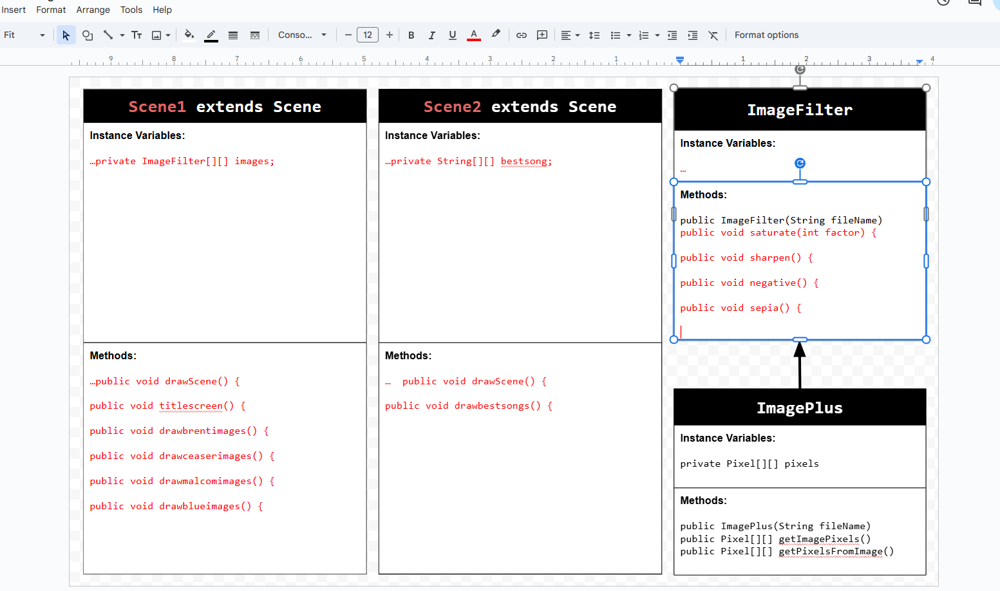

# Unit 5 - Personal Narrative / Interest Animation

## Introduction

Images are often used to portray our personal experiences and interests. We also use image filters and effects to change or enhance the mood of an image. When combined into collages and presentations, these images tell a story about who we are and what is important to us. Your goal is to create an animation using The Theater and Scene API that consists of images of your personal experiences and/or interests. In this animation, you will incorporate data related to these experiences and/or interests that can be organized in a 2D array, and use image filters and effects to change or enhance the mood of your images.

## UML Diagram

## Video

https://youtu.be/IFl2IXpLzd4
## Story Description

My project shows my favorite artists, the albums they have created and my favorite songs from those albums. The artists featured in my project create RNB music and i have spent hundereds of hours listening to these artists. The artists album covers are featuered in one of my 2D arrays and those show the covers of each album.

## Image Filter Analysis

In the negative image filter 255, the max value for each pixel color, is subtracted from the current value of each color and that new value is set for each red, green and blue value which modifies the new image by inverting colors. The Sepia image filter takes the current value of each red, blue and green pixel and adds and multiplies it by a decimal number for each color and replacing that as the new red, green and blue value, which modifies the image to look more green or brown or red and gives it an older look.